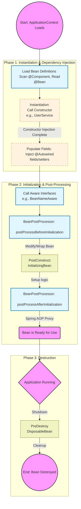

# Inversion of Control(IoC) and Dependency Injection

## Why IoC? Decoupling and the Hollywood Principle

In tradition programming, a class is responsible for creating its own dependencies,If UserService needs UserRepository, it calls new UserRepositoryImpl().

**The Problem:** This creates tight coupling. If we want to switch to MongoUserRepository, we must change the code in UserService.This makes unit testing difficult because you can't easily swap the real repository for a mock.

>Inversion of Control(IoC) is a design principle where the control of object creation and lifecycle is transferred from the application code to a framework(the Container).It follows the "Hollywood Principle" : "Don't call us, we will call you."

>Dependency Injection(DI) is the specific pattern used to implement IoC.Instead of the object looking for its dependencies, the dependencies are "injected" into it at runtime.


>Question: In a Spring Boot application, what is the primary difference between the IoC Container and a simple HashMap of objects, and why does Spring prefer ApplicationContext over the basic BeanFactory for production apps?

**Container vs HashMap**
1. Dependency Resolution : A HashMap won't automatically look inside "Object A" and realize it needs "Object B" to function. The IoC container perfroms **Recursive Dependency Lookup** to satisfy all requirements.
2. Lifecycle Management: The container doesn't just "hold" the bean; it manages a complex pipeline: 

3. Proxying: Spring often wraps our beans in **Dynamic Proxies** to enables features like @Transactional or @async. A HashMap would just give us the raw instance

**BeanFactory vs ApplicationContext**

| Feature | BeanFactory(The Foundation)                                  | ApplicationContext(The Powerhouse)                                 |
|---------|--------------------------------------------------------------|--------------------------------------------------------------------|
| Loading | LazyLoading: Beans are created only when getBean() is called | Eager Loading: All signeletons are pre-instantiated at startup     |
| APO     | Must be configured manually                                  | Integerated support for Aspect-Oriented Programming                |
| Extras  | Basic DI support                                             | Internationalization(i18n, Event Publication, and web Integeration |

>if there is a configuration error (like a missing dependency or a circular reference), ApplicationContext will throw an exception at startup(fail-fast). We rather have a deployment fail than have a production request fail later due to a missing bean.
---
## Dependency injection(DI)
Now that we know where the beans live, now for this we will know how they get there.In spring, we primarily use Constructor Injection or setter/Field injection.

>Question: If you are designing a thread-safe, immutable service, why is Constructor Injection technically superior to Field Injection (using @Autowired on the private variable)?

By using Constructor Injection, we can declare our dependency fields as final. This ensures that once the object is initialized, those references cannot be changed(immutability). From a thread-safety perspective, the JVM guarantees that any thread seeing the fully constructed object will also see the correctly initialized final fields.
```java
@Service
public class UserService{
    private final UserRepository userRepository;
    
    public UserService(UserRepository userRepository){
        this.userRepository = userRepository;
    }
}
```
By using, Field injection(using @Autowired on a private field) or Setter Injection forces the fields to be non-final.This leaves the door open for:
```java
@Service
public class UserService{
    @Autowired
    private UserRepository userRepository; // cannot be final
}
```
1. NullPointerExceptions: The object can exist in a partially initialized state.
2. Mutation: The dependency could technically be swapped out at runtime, leading to unpredictable behavior in a multithreaded environment.
---
## The Circular Dependency Dilemma
when we use Constructor Injection, we are essentially telling the JVM:"I cannot exit until my dependencies are fully provided."

```java
@Component
public class BeanA{
    private final BeanB beanB;
    
    //to create A, I must have B first
    public BeanA(BeanB beanB){
        this.beanB = beanB;
    }
}

@Component
public class BeanB{
    private final BeanA beanA;
    
    //To create B, I MUST have A first
    public BeanB(BeanA beanA){
        this.beanA=beanA;
    }
}
```

**The execution failure:**
1. Spring tries to instantiate `BeanA`. It sees it need `BeanB`.
2. Spring pauses `BeanA` and tries to instantiate `BeanB`.It sees it needs `BeanA`.
3. Spring looks for an existing `BeanA`.But `BeanA` is still in the middle of its constructor call-- its doesn't exist as a usable object in memory yet.
4. Result: `BeanCurrentlyInCreationException`

With Setter or Field Injection, Spring separates Instantiation from population

```Java
@Component
public class BeanA{
    @Autowired
    private BeanB beanB; // Field is null initially
    
    public BeanA(){} //1. Default constructor runs first
}

```
1. Spring calls the empty constructor for `BeanA`. Now, a reference to `BeanA` exists in memory(even if BeanB is still null).
2. Spring stores this "half-baked" `BeanA` in a cache.
3. Spring creates `BeanB` and sees it needs `BeanA`,
4. Spring grabs the half-baked" BeanA from the cache and injects it into BeanB.
5. BeanB is now fully initialized and injected back into BeanA.

>Solving the "Prototype into Singleton" Problem

Scope Gap: A singleton only gets a Prototype injected once. To solve this and esure a fresh prototype instance is used every time , often use Look-up Method Injection.

Instead of injecting the bean directly, we ask Spring to give us a new one whenever we need it.
```java
@Component
public abstract class EmailService { // Notice: Abstract class

    public void sendEmail() {
        TokenGenerator token = getTokenGenerator(); // Get fresh instance
        // ... logic
    }

    @Lookup
    public abstract TokenGenerator getTokenGenerator(); 
}
```
Spring will dynamically subclass EmailService and implement that abstract method to return a fresh prototype from the container.
---
>Question: Beyond @Lookup, another common way to solve this is by injecting the ObjectProvider<T> or the ApplicationContext itself. Why might an SDE3 prefer @Lookup or ObjectProvider over injecting the entire ApplicationContext?

Using Constructor Injection is the most robust way to ensure that your bean is never in a "half-baked" or invalid state.

However, even with constructors, we run into the SDE3-level problem we discussed: if the EmailService is a Singleton, its constructor only runs once. If it needs a fresh Prototype TokenGenerator for every single email it sends, standard constructor injection will fail because it will just store the first TokenGenerator it ever received and reuse it forever.

**Why Avoid Injecting the ApplicationContext**
To fix this, some developers are tempted to inject the entire ApplicationContext and call context.getBean(TokenGenerator.class) inside the sendEmail() method. While this works, it’s generally frowned upon in high-level design for a few reasons:

1. Tight Coupling: Your business logic now depends directly on the Spring Framework's "brain" (ApplicationContext).
2. Violates Interface Segregation: Your service should only know about the dependencies it needs, not the entire container that manages every bean in the system.
3. Unit Testing: It becomes much harder to write a clean JUnit test if you have to mock the entire ApplicationContext.
---
## Advanced Configuration and conditionals
Imagine we have two implementations of a `MessageService:SmsService` and `EmailService`.If we try to `@Autowire` a `MessageService`, Spring will throw a `NoUniqueBeanDefinitionException`.

**Toolbox for Ambiguity:**
1. @Primary: Tells spring, "If you are confused, pick this one by default."
2. @Qualifier("name"): Tells spring, "I want exactly this specific bean."
3. @ConditionalOnProperty: Only creates the bean if a specific configuration(like mail.enabled=true) exists in application.properties.

>Question: Imagine you are building a system that needs to use a MockPaymentGateway during local development but a StripePaymentGateway in production.
> How would we use Spring Profiles(@Profile) or Conditionals to ensure the developer don't accidentally charge real credit cards while testing on their laptops?

**Implementing Environment-Specific Injection**
1. Using `@Profile` on classes
```java
//This bean only exists when "prod" is active
@Profile("prod")
@Component
public class StripePaymentGateway implements PaymentGateway{
    @Override
    public void process(){
        // Real API calls to Stripe
    }
}

//This bean only exists when "local" or "dev" is active
@Profile({"local","dev"})
@Component
public class MockPaymentGateway implements PaymentGateway{
    @Override
    public void process(){
        // Just logs "Payment Successful"
    }
}
```
2. Using `@Bean` in a configuration Class

```java
@Configuration
public class PaymentConfig {
    @Bean
    @Profile("prod")
    public PaymentGateway realGateway() {
        return new StripePaymentGateway();
    }

    @Bean
    @Profile("!prod")
    public PaymentGateway mockGateway(){
        return new MockPaymentGateway();
    }
}
```
If we prefer centralized control, we can define them in a `@Configuration` class.

---
## The Bean Lifecycle
**Constructor vs @PostConstruct**

In Java, when the Constructor is running, the object is still being "born." In the Spring ecosystem, this means:
1. Proxies aren't ready: If our initialization logic requires Spring features like `@Transactional` or `@Async`, they won't work in the constructor because the Spring proxy hasn't wrapped the bean yet.
2. Field Injection is null: If we happened to use `@Autowired` on a field, that field will be `null` while the constructor is executing.

`@PostConstruct` is called after the bean is fully constructed and all dependencies(via constructor, setter, or field) have been injected. It is the "safe zone" for startup logic.

**The warm-up pattern**
A common task is "warming up" a local cache or verifying a connection to a downstream service immediately at startup.

```java
@Component
public class CurrencyExchangeService{
    private final ExternalExchangeClient client;
    private Map<String, Double> rateCache;
    
    public CurrencyExchangeService(ExternalExchangeClient client){
        this.client = client;
        //Logic here would fail if 'client' needs a Spring proxy to work
    }
    
    @PostConstruct
    public void init(){
        //This is safe. The bean is fully "managed" by Spring now.
        this.rateCache = client.getLatestRates();
        System.out.println("Cache warmed up with " + rateCache.size());
    }
}
```

## Bean Scopes & Proxies
How beans live and die in memory.

The two most common scopes are:
1. Singleton : One instance per IoC container.
2. Prototype: A new instance is created every time `getBean()` is called.

**The "Scope Gap" Problem**
Imaging we have a Singleton `OderProcessor` and we want to inject a Prototype `TransactionToken`.

Because the `OrderProcessor` is only created once, it will only have the `TransactionToken` inject once.Even through `TransactionToken` is a prototype, the `OrderProcessor` will keep using that same first instance forever.

>Question: If you want a new instance of the prototype bean every time a method in your singleton bean is called, how would you handle that without injecting the entire ApplicationContext?

`@Lookup` is a clean, "Spring-native" way to handle the scope gap.

By making the method `abstract` and annotating it with `@Lookup`, we are telling the Spring container: "Every time this method is called, go to the context and find me the bean of the return type(TokenGenerator)." Because `TokenGenerator` is a Prototype, Spring will naturally create a new instance for us.

Spring implements this using CGLIB at runtime. It creates a proxy subclass of your EmailService and overrides that abstract method with logic that essentially does a container.getBean(TokenGenerator.class).

**Why not just use `ObjectProvider<T>`?
```java
@Component
public class EmailService{
    // We inject a provider, not the bean itself
    private final ObjectProvider<TokenGenerator> tokenGeneratorObjectProvider;
    
    public EmailService(ObjectProvider<TokenGenerator> tokenGeneratorObjectProvider){
        this.tokenGeneratorObjectProvider=tokenGeneratorObjectProvider;
    }
    
    public void sendEmail(){
        // we call .getObject() to get a fresh Prototype instance
        TokenGenerator token = tokenGeneratorObjectProvider.getObject();
        //... use token
    }
}
```
>The advantage of ObjectProvider over @Lookup is that it doesn't require abstract methods or CGLIB proxying. It’s also type-safe and allows you to handle cases where a bean might not exist (using getIfAvailable()).



---
## Explaining the flow
When presenting this flow, emphasize these critical architectural timings:
1. Instantiation: The JVM creates the object(new).If we use Constructor Injection, dependencies are available immediately.If we use Field Injection, the field sre still null.
2. Aware Interfaces: Spring "injects itself" into the bean(e.g., giving the bean access to the `ApplicationContext` if needed).
3. BPP(Before Initialization):This is your last chance to modify the raw bean instance before its official startup logic (`@PostConstruct`) runs.
4. Initialization(`PostConstruct`): This is where you put your startup logic. All dependencies (`@Autowired`) are guaranteed to be injected and safe to use.
5. BPP(After Initialization): If Spring needs to wrap your bean in a Proxy (for `@Transactional`, `@Async`, or `@Retry`), it usually happens in this phase.
6. Destruction: Just before the application exits, `@PreDestroy` allows you to release resources (closing database connections, stopping background threads, cleaning temporary files).