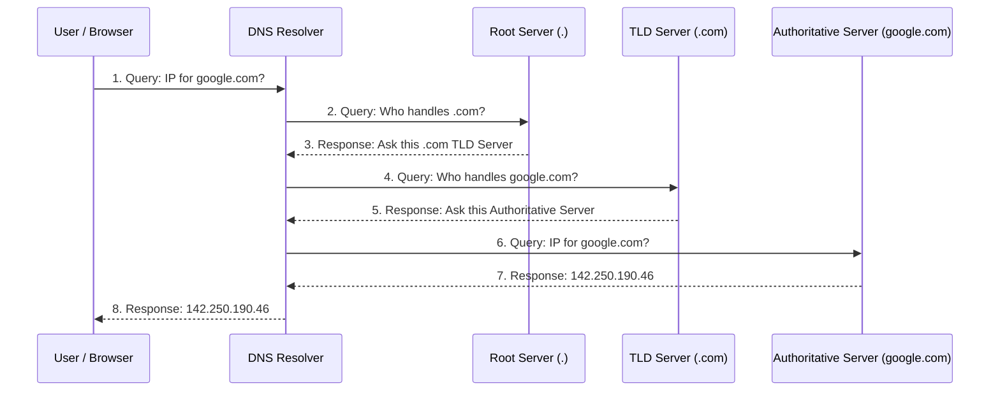

# Domain Name System

```text
1. Core Purpose & Function : What DNS is and the problem its solves
2. The DNS Hierarchy : The different types of DNS servers(Recursive,Root, TLD,Authoritative)
3. The Resolution Journey : Step-by-step flow of DNS query
4. DNS Record Types: Deep dive into A, AAAA, CNAME, ALIAS, MX, and TXT records.
5. Caching & TTL: How performance is optimized and the trade-offs involved.
6. Advanced/Systems Design Concepts: DNS routing (Anycast, Round Robin) and Security (DNSSEC).
```

## Topic 1 : Core purpose & Function

When we want to access the website, we provide readable domain name like google.com and browser and network routers convert it into Internet protocol (IP) like 142.250.190.46 .

**Why this abstraction is needed?**

A company or person can change its underlying physical servers, move to cloud provider or update its IP addresses. and we can map it with same domain name.

>If a user types a URL into their browser, but the DNS system completely fails to resolve the domain name to an IP address, what specific behavior will the user experience, and does this indicate that the target website's actual web servers are down?
> If DNS fails completely, it means browser not able to find the page.It show browser level network like ERR_NAME_NOT_RESOLVED or the site can't be reached.


## Topic 2 : The DNS Hierarchy

