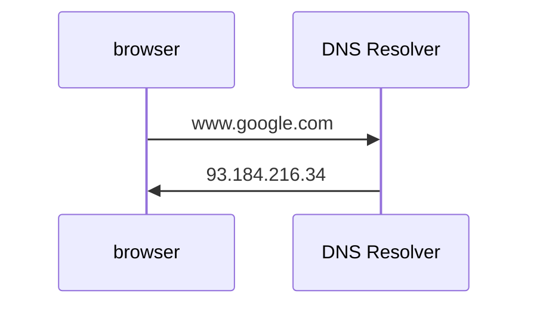
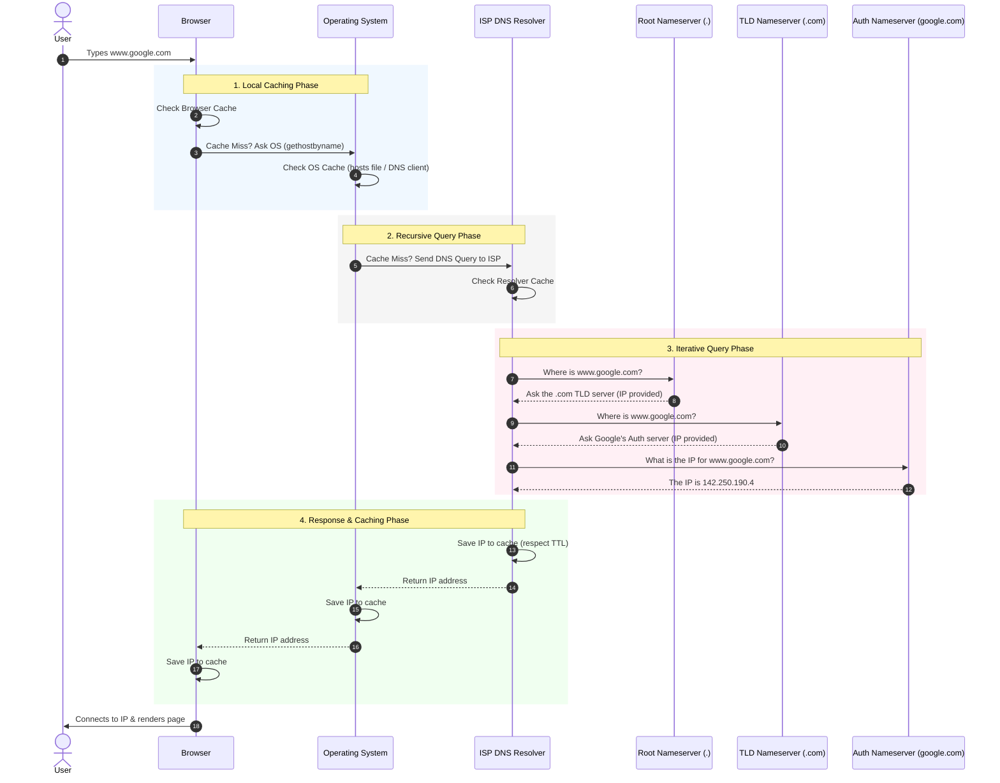

# Domain Name System

```text
1. Core Purpose & Function : What DNS is and the problem its solves
2. The DNS Hierarchy : The different types of DNS servers(Recursive,Root, TLD,Authoritative)
3. The Resolution Journey : Step-by-step flow of DNS query
4. DNS Record Types: Deep dive into A, AAAA, CNAME, ALIAS, MX, and TXT records.
5. Caching & TTL: How performance is optimized and the trade-offs involved.
6. Advanced/Systems Design Concepts: DNS routing (Anycast, Round Robin) and Security (DNSSEC).
```

1. DNS is internet directory. 
2. It translates human-readable domain name into IP address (such as google.com to machine readable IP address like 93.184.296.34 example)

3. How does DNS Work?



