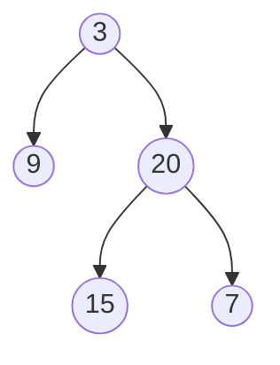

---

# Problem 1 
> **HashMap:** [Longest Consecutive Sequence](https://leetcode.com/problems/longest-consecutive-sequence/)

**Rephrase problem**
Unsorted array of integers `nums`, return the length of the longest consecutive elements sequence

```text
Input : nums = [100,4,200,1,3,2]
Output : 4

ans is 4 because [1,2,3,4] 
```

```text
nums = [100,4,200,3,1]

map=[]
max=0
n= 6

|__ pick i=0, val : 100
|   |__ L=0, R=0
|   |__ map.containsKey(100) ? no
|   |__ map.containsKey(99) ? No
|   |__ map.containsKey(101) ? No
|   |__ map =[100, 1+0+0] => map=[100,1]
|   |__ map = [100-0, 1+0+0] => map = [100,1]
|   |__ map = [100-0, 1+0+0] => map =[100,1]
|   |__ max = (0,1)
|__ pick i=1, val: 4
|   |__ L=0, R=0
|   |__ map.containsKey(4)? no
|   |__ map.containsKey(3) ? no
|   |__ map.containsKey(5)?no
|   |__ map = [4, 1+0+0] => map=[4,1]
|   |__ map = [4-0, 1+0+0] => map=[4,1]
|   |__ map = [4+0, 1+0+0] => map=[4,1]
|   |__ max =(1,1) ->1
|__ pick i=2, val:200
|   |__ L=0, R=0
|   |__ map.containsKey(200) ? no
|   |__ map.containsKey(199) ? no
|   |__ map.containsKey(201) ? no
|   |__ map = [200, 1+0+0] => map =[200,1]
|   |__ map = [200-0, 1+0+0] => map =[200,1]
|   |__ map = [200+0, 1+0+0] => map = [200,1]
|__ pick i=3, val :3
|   |__ L=0, R=0
|   |__ map.containsKey(3)? No
|   |__ map.containsKey(2)? no
|   |__ map.containsKey(4)? Yes
|       |__ r = 1
|   |__ map = [3,1+0+1] => [3,2]
|   |__ map = [3-0, 1+0+1] => [3,2]
|   |__ map = [3+1, 1+0+1] => [4,2]
|   |__ max = max(1,2) => 2
|__ pick i=4, val:1
|   |__ L=0, R=0
|   |__ map.containsKey(1)? No
|   |__ map.containsKey(0) ? No
|   |__ map.containsKey(2)? no
|   |__ map = [1, 1+0+0] => map = [1,1]
|   |__ map = [1-0, 1+0+0] => map = [1,1]
|   |__ map = [1+0, 1+0+0] => map =[1,1]
|   |__ max = max(2,1) => 2

max = 2
```

```java
class Solution{
    public int longestConsecutive(int[] nums){
        int n = nums.length; int max=0;
        HashMap<Integer,Integer> map = new HashMap<>();
        for(int num:nums){
            int left=0;
            int right=0;
            if(map.containsKey(num)) continue;
            if(map.containsKey(num-1)) left = map.get(num-1);
            if(map.containsKey(num+1)) right = map.get(num+1);
            map.put(num, 1+left+right);
            map.put(num-left,1+left+right);
            map.put(num+left,1+left+right);
            max=Math.max(max,map.get(num));
        }
        return max;
    }
}
```

# Problem 2

>**Graph BFS:** [Rotting Oranges](https://leetcode.com/problems/rotting-oranges/)

**Rephrase problem**
Given mxn grid -> 2D array , 0->empty , 1->fresh oranges , 2->rotten oranges

every min, any fresh orange that in up, down, left, right adjacent to a rotten orange becomes rotten 

return min number of minutes that must elapse until no cell has a fresh orange , if not possible -1;

**Examples**
```text
[2,1,1]
[1,1,0]
[0,1,1]

1 min 
[2 2 1]
[2 1 0]
[0 1 1]

2 min
[2 2 2]
[2 2 0]
[2 1 1]

3 min
[2 2 2]
[2 2 0]
[2 2 1]

4 min
[2 2 2 ]
[2 2 0]
[2 2 2]
```

**Intuition**
```text
[2 1 1]
[0 1 1]
[1 0 1]

find first rotten
grid[0][0] 
q =[(0,0)]
visited[0][0] =true

run while loop till empty
Pair = r=0, c=0
count=1
check in 4-directions
r=0,c=1 (val=1) -> rotton -> put it in queue (0,1) -> marked visited
r=1, c=0 (val=0) -> empty -> marked visited

queue is not empty
Pair => r=0, c=1
count=2
check in 4 direction
r=0, c=2 -> rotten -> put in the queue(0,2) -> marked visited
r=1, c=1 -> rotten -> put in the queue (1,1) -> marked visited
r=0,c=0 -> already visited 

queue is not empty
Pair => r=0, c=2 
check in 4-direction


```

>NOTE -> It is multisource spread 

```text
First count the all fresh oranges and add all rotten oranges in queues

[2 1 1]
[1 1 0]
[0 1 1]

freshOranges = 6
q =[(0,0)]

Do BFS traversal level by level

```

```java
import java.util.LinkedList;

class Solution {
    public int orangesRotting(int[][] grid) {
        int freshOranges = 0;
        int mins = 0;
        int n = grid.length;
        int m = grid[0].length;
        

        Queue<int[]> q = new LinkedList<>();

        for (int i = 0; i < n; i++) {
            for (int j = 0; j < m; j++) {
                if (grid[i][j] == 1) freshOranges++;
                if(grid[i][j]==2) q.add(new int[]{i,j});
             }
        }
        
        int[][] dir = {{0,1},{0,-1},{1,0},{-1,0}};
        
        while(!q.isEmpty()){
            int size = q.poll();
            boolean rotten = false;
            
            for(int i=0;i<size;i++){
                int[] curr = q.poll();
                int r = curr[0];
                int c = curr[1];
                
                for(int[] d : dir){
                    int nr = r + d[0];
                    int nc = c + d[1];
                    
                    if(nr>=0 && nr<rows && nc>=0 && nc<cols && grid[nr][nc]==1){
                        grid[nr][cr]=2;
                        freshOranges--;
                        q.add(new int[]{nr,nc});
                        rotten=false;
                    }
                }
            }
            if(rotten) mins++;
        }
        return freshOranges==0? mins:-1;
    }
}
```

# Problem 3
>**Tree BFS:** [Binary Tree ZigZag Level Order Traversal](https://leetcode.com/problems/binary-tree-zigzag-level-order-traversal/)

**Rephrase problem**

Given a root of a binary tree, zigzag level order



```text
Input: root [3,9,20,null,null,15,7]
Output : [[3],[20,9],[15,7]]
```

**Brute force**
level order traversal
1. do the level order -> and then for the odd index of the list reverse the list

```java
import java.util.ArrayList;
import java.util.Collections;

public class TreeNode {
    int val;
    TreeNode left;
    TreeNode right;

    TreeNode() {
    }

    TreeNode(int val) {
        this.val;
    }

    TreeNode(int val, TreeNode left, TreeNode right) {
        this.val = val;
        this.right = right;
        this.left = left;
    }
}

class Solution {
    public List<List<Integer>> zigzagLevelOrder(TreeNode root) {
        List<List<Integer>> result = new ArrayList<>();
        if (root == null) return result;

        Queue<TreeNode> q = new LinkedList<>();
        q.add(root);
        int level = 0;

        while (!q.isEmpty()) {
            int size = q.size();
            level++;
            List<Integer> ans = new ArrayList<>();
            for (int i = 0; i < size; i++) {
                TreeNode curr = q.poll();
                ans.add(curr.val);
                if (curr.left != null) q.offer(curr.left);
                if (curr.right != null) q.offer(curr.right);
            }
            result.add(new ArrayList<>(ans));
        }

        for (int i = 0; i < result.size(); i++) {
            if (i % 2 == 1) {
                Collections.reverse(result.get(i));
            }
        }
        return result;
    }
}
```

```java
import java.util.ArrayList;
import java.util.LinkedList;

class Solution {
    public List<List<Integer>> zigzagLevelOrder(TreeNode root) {
        List<List<Integer>> result = new ArrayList<>();
        if (root == null) return result;
        Queue<TreeNode> q = new LinkedList<>();
        q.offer(root);
        boolean leftToRight=true;
        while(!q.isEmpty()){
            int size = q.size();
            Deque<Integer> level = new Deque<>();
            
            for(int i=0;i<size;i++){
                TreeNode curr= q.poll();
                if(leftToRight){
                    level.addLast(curr.val);
                }else{
                    level.addFirst(curr.val);
                }
                if(curr.left!=null) q.offer(curr.left);
                if(curr.right!=null) q.offer(curr.right);
            }
            result.add(new ArrayList<>(level));
            leftToRight = !leftToRight;
        }
        return result;
    }
}
```


