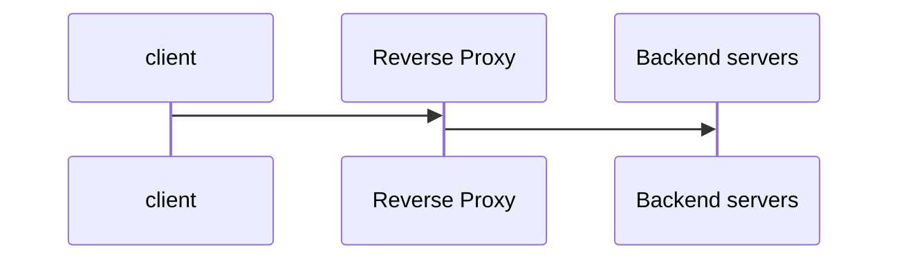
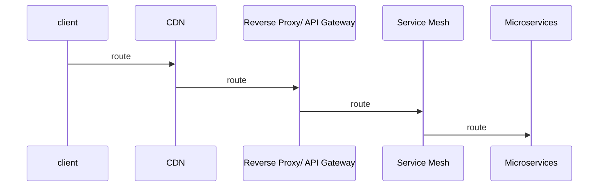

# Reverse Proxy

A **reverse Proxy** is a server that sits in front of backend applications servers and act as the single entry point for clients.

Instead of clients talking directly to backend services, they talk to the reverse proxy, which forwards the request internally.

A reverse proxy is **opposite of a forward proxy**, where the proxy represents the client.

## Why Do companies use reverse Proxies?

| Need                 | Why                                                                                     |
|----------------------|-----------------------------------------------------------------------------------------|
| Load Balancing       | Distributed traffic across multiple instances(round-robin, least connections, IP-hash). |
| Security Layer       | Hide backend IPs, prevent DDoS, rate-limit, filter malicious traffic.                   |
| SSL/TLS Termination  | Offload CPU-heavy TLS handshakes from application servers.                              |
| Caching              | Serve static content without hitting backend(Nginx/Cloudfare).                          |
| Routing/ API Gateway | Send/api/user to service A, /api/cart to service B.                                     |
| Centralized Logging  | Track requests before they reach downstream services.                                   |

## How a Reverse Proxy Works Internally

Let's break down what happens when a client sends a request:
**Step-by-Step flow:**
1. DNS resolves domain to reverse proxy IP. Example: api.example.com -> 34.121.10.11(Nginx/HAProxy/Envoy)
2. Reverse proxy receives the request on port 80/443
3. Proxy performs : Check routing rules, Apply rate limiting/filters, SSL termination, Authentication checks
4. Load balancing decision 
5. Forward request to backend server
6. Receive response from backend
7. Modify/ compress/ cache if enabled
8. Return response to client

## Reverse Proxy vs API Gateway vs Load Balancer

| Feature                | Reverse Prxoy | API Gateway | Load Balancer      |
|------------------------|---------------|-------------|--------------------|
| Entry point for client | Yes           | Yes         | Not always exposed |
| Routing by path/method | Basic         | Advanced    | No                 |
| Auth(JWT, OAuth2)      | No            | Yes         | No                 |
| Rate limiting          | Basic         | Advanced    | No                 |
| SSL termination        | Yes           | Yes         | Yes                |
| API Versioning         | No            | Yes         | No                 |
| Caching                | Yes           | No          | No                 |   

## Where Reverse Proxy Fits in a Microservices Architecture

