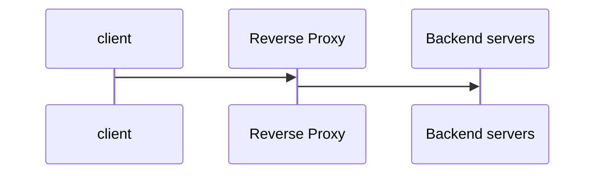
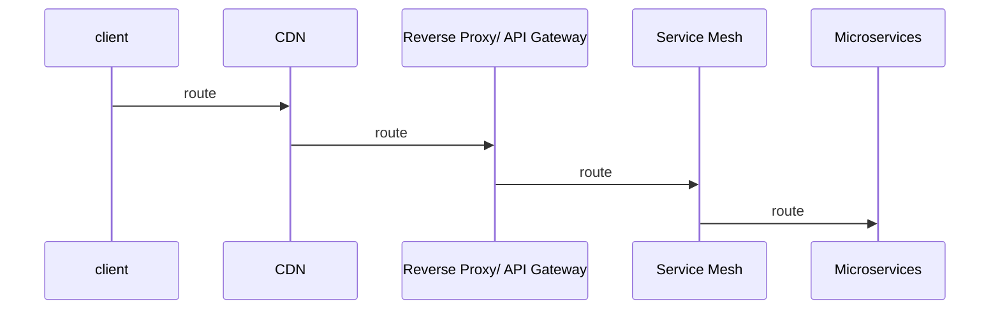

# Reverse Proxy

A **reverse Proxy** is a server that sits in front of backend applications servers and act as the single entry point for clients.

Instead of clients talking directly to backend services, they talk to the reverse proxy, which forwards the request internally.

A reverse proxy is **opposite of a forward proxy**, where the proxy represents the client.

## Why Do companies use reverse Proxies?

| Need                 | Why                                                                                     |
|----------------------|-----------------------------------------------------------------------------------------|
| Load Balancing       | Distributed traffic across multiple instances(round-robin, least connections, IP-hash). |
| Security Layer       | Hide backend IPs, prevent DDoS, rate-limit, filter malicious traffic.                   |
| SSL/TLS Termination  | Offload CPU-heavy TLS handshakes from application servers.                              |
| Caching              | Serve static content without hitting backend(Nginx/Cloudfare).                          |
| Routing/ API Gateway | Send/api/user to service A, /api/cart to service B.                                     |
| Centralized Logging  | Track requests before they reach downstream services.                                   |

## How a Reverse Proxy Works Internally

Let's break down what happens when a client sends a request:
**Step-by-Step flow:**
1. DNS resolves domain to reverse proxy IP. Example: api.example.com -> 34.121.10.11(Nginx/HAProxy/Envoy)
2. Reverse proxy receives the request on port 80/443
3. Proxy performs : Check routing rules, Apply rate limiting/filters, SSL termination, Authentication checks
4. Load balancing decision 
5. Forward request to backend server
6. Receive response from backend
7. Modify/ compress/ cache if enabled
8. Return response to client

## Reverse Proxy vs API Gateway vs Load Balancer

1. **Reverse Proxy(The Bouncer):**  Protects the network. It handles generic web traffic tasks that require zero knowledge of your business logic.
2. **Load Balancer(The Traffic Cop):** Distributes incoming traffic evenly across a pool of healthy servers so no single machine gets overwhelmed.
3. **API Gateway(The Front desk):** Understands your actual business logic. It knows about user tokens, specific microservice endpoints, and data payloads.

## Where Reverse Proxy Fits in a Microservices Architecture

## Questions 
>When a mobile app sends a secure, encrypted HTTPS request to your system, the server needs to decrypt it (a CPU-intensive process called SSL Termination). Given the roles defined previously, which component—the Reverse Proxy at the edge, or the internal API Gateway—should ideally handle decrypting this traffic, and why?

1. **Direct Answer:** SSL Termination should be handled at the edge by the Reverse Proxy.
2. **The Security Reason:** "Architecturally, we want to intercept and decrypt public internet traffic at the outermost perimeter before it enters our trusted internal network."
3. **The Performance Reason:** Decrypting HTTPS is incredibly CPU-intensive. By offloading this to a lightweight Reverse Proxy like Nginx, we free up the API Gateway's CPU to focus purely on business logic like authentication and protocol translation.
4. **Industry Term:** This pattern is known as SSL Offloading or SSL Termination.

>Imagine you are designing the backend for a frontend React application. The React app consists of a static index.html file, some CSS, and an app.js bundle. When a user navigates to your website, would you configure your API Gateway to serve these static files, or your Reverse Proxy? And why?

1. **Direct Answer:** Static files like React's HTML, CSS, and JS bundles should be served by the Reverse Proxy, not the API Gateway.
2. **The 'Why' (Separation of Concerns):** Static content doesn't require business logic, user authentication, or protocol translation. Forcing the API Gateway to serve static files wastes expensive compute resources
3. **The Performance Benefit:** By caching these files at the Reverse Proxy at the edge of the network, we dramatically decrease latency for the user and completely offload that static traffic from our internal network.

>A user opens a mobile app to view their personalized feed. The app needs to securely fetch the dynamic feed data over HTTPS.
Can you trace the exact path this request takes, starting from the moment it hits your infrastructure, and list the one main job each of these three components performs on that specific request before passing it to the next layer?
Reverse Proxy ,Load Balancer ,API Gateway

1. **Step 1 (The Edge):** The mobile client resolves the domain via DNS and hits our outermost perimeter: the Reverse Proxy. Here, we perform SSL Termination to decrypt the HTTPS request, dropping bad connections early and saving CPU cycles for the deeper layers.
2. **Step 2 (Distribution):** The decrypted traffic then passes through an External Load Balancer, which evenly distributes the massive volume of incoming requests across our cluster of API Gateway instances to prevent any single gateway from being overwhelmed.
3. **Step 3 (Business Logic & Internal Routing):** The request reaches the API Gateway. Here, we validate the user's identity via Authentication. Once authenticated, the gateway acts as a Layer 7 router, forwarding the request to the specific internal microservice (often via an internal load balancer).

