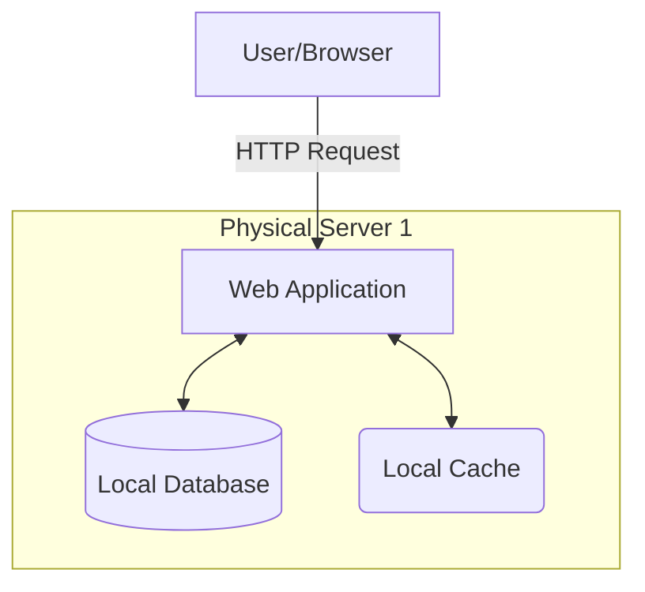
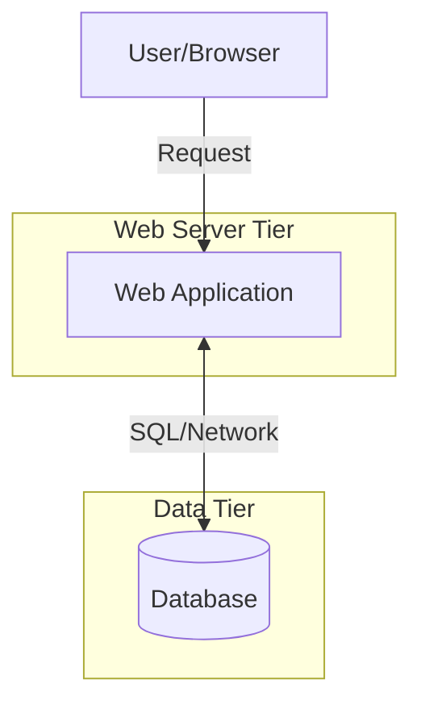
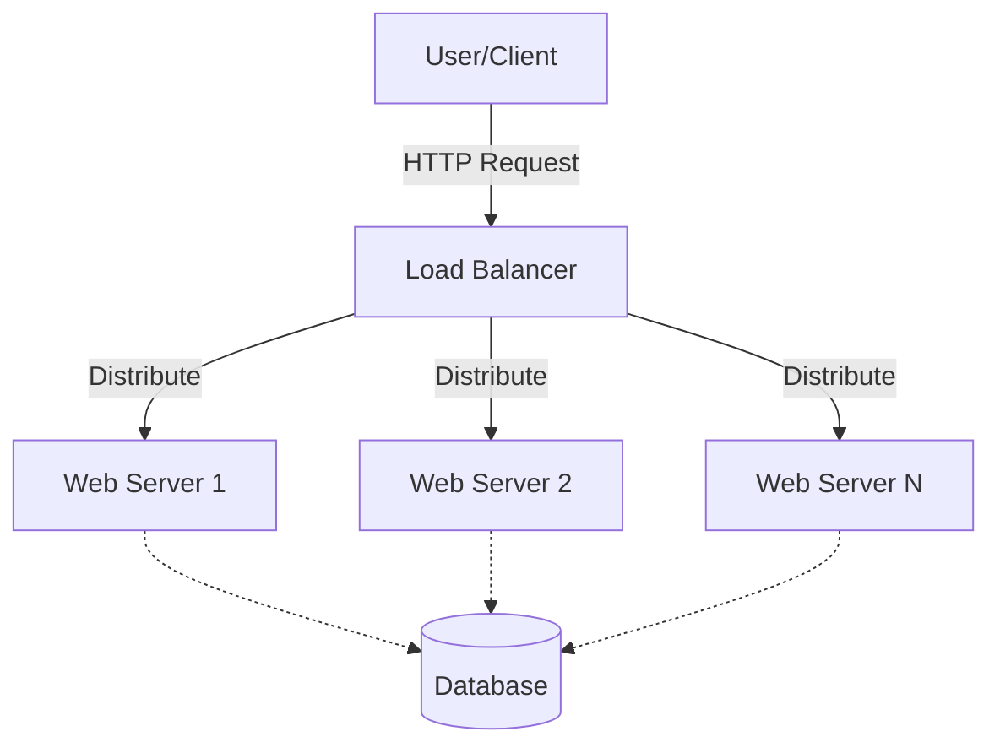

Let's use the flow to build a complete roadmap for scaling from zero to millions of users.

### The System Design Scaling Roadmap

1. **Single Server Setup**
2. **Database Separation & Selection**
3. **Horizontal Scaling & Load Balancing**
4. **Database Replication**
5. **Caching & Content Delivery Networks (CDN)**
6. **Stateless Architecture**
7. **Multi-Data Center Routing**
8. **Decoupling with Message Queues**
9. **Database Sharding**
10. **Logging, Metrics, and Automation**

---

### Topic 1: Single Server Setup

In the absolute beginning, every component of your application—the web server, the database, and the cache—runs on a single machine.

The core flow of a request at this stage is foundational:

* A user requests a domain name.
* The Domain Name System (DNS) translates that domain into an IP address.
* The client sends an HTTP request directly to that IP address.
* The server processes the logic and returns a payload (usually JSON for mobile/APIs or HTML for web browsers).

**Interview Focus:**
In a system design interview, you rarely spend much time here, but stating this baseline is important. It shows the interviewer you understand the Minimum Viable Product (MVP) and do not prematurely over-engineer. You acknowledge that when traffic is very low, vertical scaling (adding more CPU/RAM to this one machine) is the simplest and most cost-effective solution.

However, vertical scaling has a hard hardware limit and this setup represents a massive Single Point of Failure (SPOF). If this one machine goes down, the entire business goes offline.

To start scaling past the limits of a single machine, what is the first logical split you should make to separate the workload into multiple servers?

**Answer**: If the web server crashes in a single-server setup, the data goes down with it. By moving to a separate database server, we protect the user data and allow the web tier and data tier to scale independently.

---

You identified the exact core issue. If the web server crashes in a single-server setup, the data goes down with it. By moving to a separate database server, we protect the user data and allow the web tier and data tier to scale independently.

### Topic 2: Database Separation & Selection 🗄️

Now our architecture has two distinct parts:

* **Web Tier:** Handles the HTTP requests and business logic.
* **Data Tier:** Focuses entirely on securely storing and retrieving information.

Separating the servers is only half the battle. In an interview, you must also justify *which* type of database you are choosing for this new dedicated server. The two main categories are:

1. **Relational Databases (SQL):** Like MySQL or PostgreSQL. They store data in highly structured tables and rows, allowing for complex join operations.
2. **Non-Relational Databases (NoSQL):** Like Cassandra or DynamoDB. They store data in key-value pairs, documents, or wide columns, and generally do not support complex joins.

Let's test this in the context of an interview scenario. If our non-functional requirements dictate that our application will handle massive amounts of unstructured data and requires super-low latency, which type of database (SQL or NoSQL) would you choose to use?
**Answer**: NoSQL databases are highly optimized for low-latency read/write operations and can handle unstructured or semi-structured data (like JSON documents) much more easily than traditional SQL databases.

---

### Topic 3: Horizontal Scaling & Load Balancing ⚖️

Now that we have separated our tiers, we hit a new wall. As our user base grows toward those "millions of users," a single web server will eventually run out of CPU and RAM. We need to move from **Vertical Scaling** (one big server) to **Horizontal Scaling** (many smaller servers).

However, if we have ten web servers, how does a user's request know which one to go to? This is where the **Load Balancer** comes in. It sits in front of your server pool and distributes incoming traffic evenly.

**Interview Focus:**
A Load Balancer improves **availability**. If "Web Server 1" crashes, the Load Balancer detects the failure and stops sending traffic there, routing everything to the healthy servers instead.

We've solved the bottleneck for the Web Tier by adding more servers. But looking at our diagram above, we now have many web servers all talking to **one single database**.

If that single database becomes the new bottleneck because it's overwhelmed with "Read" requests, what technique from our roadmap could we use to spread that read-heavy load across multiple database instances?
**Answer**:By separating writes from reads, you ensure that the heavy volume of "viewing" requests doesn't slow down the important "saving" requests.

