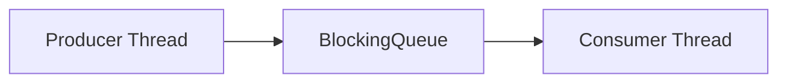
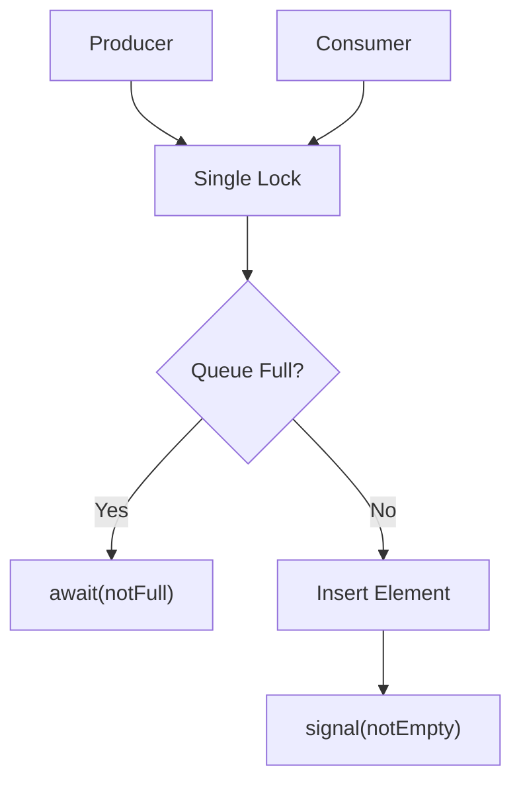
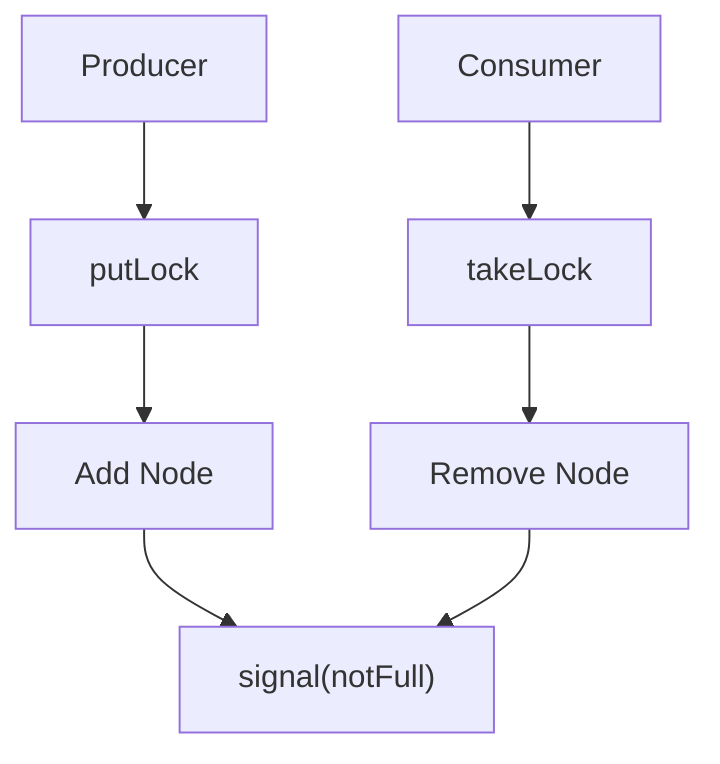

# Blocking queue

## Analogy 

**Restaurant Kitchen**
- chefs(Producer) make dishes 
- Waiters(Consumers) pick dishes
- Kitchen Counter(BlockingQueue) stores dishes between them

Explain: 
- if counter is full -> chefs must wait
- if counter is empty -> waiters must wait
- The counter is shared -> needs rule for access

| Queue               | Structure  | Capacity             | Lock Model | Best use                        |
|---------------------|------------|----------------------|------------|---------------------------------|
| ArrayBlockingqueue  | Array      | Always fixed         | 1 lock     | Stable, predictable, throughput |
| LinkedBlockingQueue | LinkedList | Bounded or Unbounded | 2 locks    | High concurrency                |  

ArrayBlockingQueue 
- A narrow plate rack with 10 slot
- Only one person can stand in front
- Producers and consumers must share the space

LinkedBlockingQueue
- chefs stands at left (producer)
- Waiter stands at right (consumer)
- They don;t get each other way -> parallel work

```java
import java.util.concurrent.BlockingDeque;

BlockingDeque<String> queue = new ArrayBlockingQueue<>(5);

Runnable producer = () ->{
    try{
        while(true){
            String item = "dish";
            queue.put(item);
            System.out.println("Produced: "+ item);
        }
    }catch(Exception ignored){}
};

Runnable consumer = () -> {
    try{
        while(true){
            String item = queue.take();
            System.out.println("consumed: "+item);
        }
    }catch (Exception ignored){}
};

new Thread(producer).start();
new Thread(consumer).start();
```





```java
BlockingQueue<String> queue = new LinkedBlockingQueue<>(1000);

ExecutorService producers = Executors.newFixedThreadPool(5);
ExecutorService consumers = Executors.newFixedThreadPool(5);

for(int i=0;i<5;i++){
    producers.submit(()->{
        while(true) queue.put("task");
        });
}

for(int i=0;i<5;i++){
    consumers.submit(()->{
        while(true) queue.take();
        });
}
```


