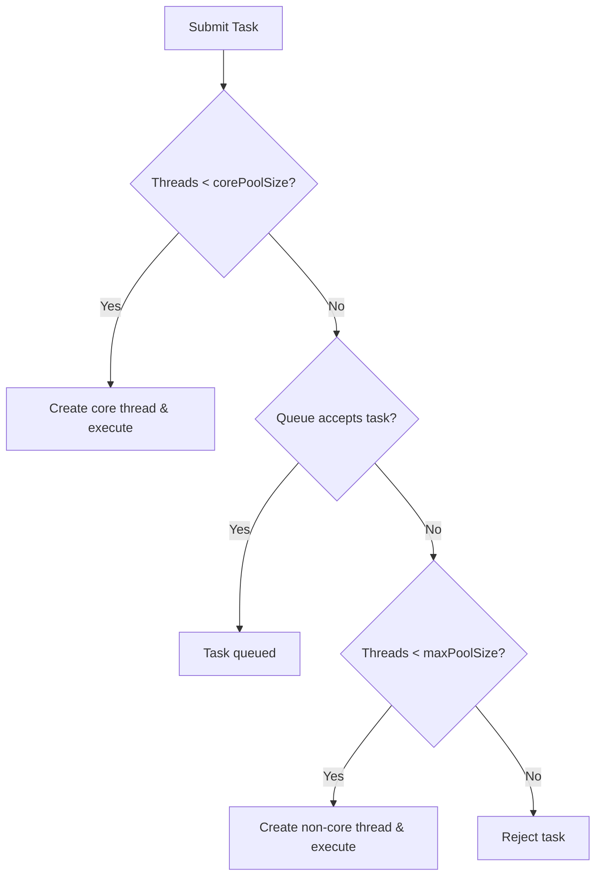

## Why Thread Pools Exist

Creating a new Thread for every task:
- is Expensive
- causes context switching overhead
- can exhaust CPU and memory

> Thread pools reuse threads, control concurrency, and improve stability.

## ExecutorService Basic

- ExecutorService is a high-level abstraction to manage threads.
- We submit tasks, not threads
- Thread lifecycle is managed by the executor

Common methods:
```text
submit(Runnable)
submit(callable)
shutDown()
shutDownNow()
```
## FixedThreadPool vs CachedThreadPool

```text
Executors.newFixedThreadPool(n)
```
**Internal Configuration**
- corePoolSize = n
- maxPoolSize = n
- Queue: LinkedBlockingQueue(unbounded)

**Behaviour**
- Thread are created lazily
- At most n concurrent threads
- Extra tasks wait in the queue

> can have high latency if queue grows too large

## CachedThreadPool
```text
Executors.newCachedThreadPool();
```
**Internal Configuration**
- corePoolSize =0;
- maxPoolSize = Integer.MAX_VALUEl
- Queue : SynchronousQueue
- Thread die after 60s of idle time

**Behaviour**
- creates threads immediately if non are idle
- No real queueing
- Very fast

> FixedThreadPool controls load via queues, CachedThreadPool controls load via thread creation.

## ThreadPoolExecutor 

Key components :
- corePoolSize
- maximumPoolSize
- BlockingQueue
- RejectedExecutionHandler
- KeepAliveTime

## ThreadPoolExecutor Task submission Flow

**Exact Decision Order**
1. if current threads < corePoolSize -> Create a new thread
2. Else attempt to enqueue task -> if queue accepts, task waits
3. if queue is full AND threads < maxPoolSize -> Create non-cire thread
4. Else -> Reject task




