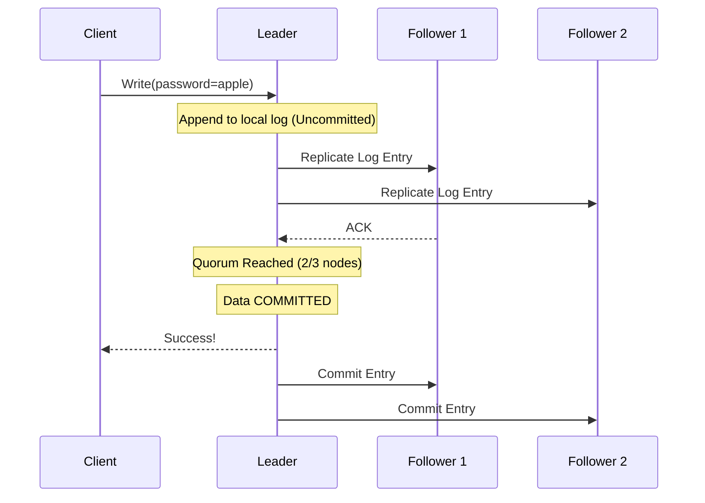

# System Design Interview Prep: Consensus Algorithms & Leader Election

## 1. The "Split-Brain" Problem 🧠
* **The Problem:** In a distributed system, if a network partition isolates nodes (they are alive but cannot talk to each other), they might independently accept conflicting data. If they both think they are the "Primary," data corruption occurs.
* **The Solution (Quorum):** A system must require a **majority vote (Quorum)** to accept new data or elect a leader. In a 3-node cluster, 2 nodes must agree. An isolated node only has 1 vote, so it safely refuses to act, preventing split-brain.

## 2. Paxos vs. Raft 🛶
* **Paxos:** The academic pioneer. Mathematically proven but famously difficult to understand and translate into real-world code, leading to buggy, custom implementations.
* **Raft:** Created specifically for **understandability**. It achieves the exact same safety as Paxos but breaks the problem down into two easy-to-manage phases: **Leader Election** and **Log Replication**.

## 3. How Raft Works 🗳️
### A. Leader Election
1.  **Heartbeats:** The Leader constantly pings Followers to say "I'm alive."
2.  **Randomized Timeouts:** Followers have randomized countdown timers (e.g., 150ms - 300ms). If a timer hits zero without a heartbeat, the Follower becomes a Candidate. *Randomization prevents tie votes where everyone wakes up at once.*
3.  **Voting:** The Candidate votes for itself and requests votes. The first to reach a Quorum becomes the new Leader.
4.  **Safety Rule:** A Follower will **reject** a Candidate if the Candidate's log is older or shorter than its own. This guarantees the new leader always has the most up-to-date data.

### B. Log Replication (Writing Data)
1.  Client sends data to the Leader.
2.  Leader adds it to its log (Uncommitted).
3.  Leader forwards to Followers.
4.  Followers write to their logs and reply "ACK".
5.  Once the Leader gets a **Quorum of ACKs**, it commits the data, replies "Success" to the client, and tells Followers to commit.
* *Crash Scenario:* If the Leader crashes before reaching a Quorum, the uncommitted data is safely overwritten and discarded by the next Leader.

## 4. Flow Diagram: Raft Log Replication & Commit


## 5. Real-World Use Cases 🌍
Consensus systems are heavy and require a lot of network voting. **Never use them to store massive blobs of user data.** Use them strictly for **System State and Metadata** (a few gigabytes max).
* **etcd:** The brain of Kubernetes. Stores cluster configuration and node states.
* **ZooKeeper:** Manages leader election for Kafka brokers and Hadoop.
* **Consul:** Service mesh and service discovery (finding IP addresses of active services).

## 6. The Interview Playbook 🗣️
**Q: "If the primary database crashes, how do the standby nodes safely take over?"**
> **A:** "We would use a consensus protocol like Raft to manage the cluster state. The standby nodes rely on heartbeats; when those drop, they initiate a Leader Election. Because Raft uses randomized timeouts, one node will successfully gather a quorum of votes first and become the new primary. Furthermore, Raft's safety rules guarantee that a node missing recent committed data cannot win the election, keeping our data consistent and preventing a split-brain scenario."

## 7. Code Snippet: Spring Boot Leader Election 💻
In a real backend role, you do not write Raft from scratch. You use Spring Integration paired with a consensus store (like ZooKeeper/Curator or Hazelcast) to ensure only *one* instance of your service runs a specific scheduled task (like billing customers).

**Dependencies:** `spring-integration-zookeeper`, `curator-framework`

```java
import org.springframework.context.annotation.Bean;
import org.springframework.context.annotation.Configuration;
import org.springframework.integration.zookeeper.config.LeaderInitiatorFactoryBean;
import org.springframework.integration.support.leader.LockRegistryLeaderInitiator;
import org.springframework.context.event.EventListener;
import org.springframework.integration.leader.event.OnGrantedEvent;
import org.springframework.integration.leader.event.OnRevokedEvent;
import org.springframework.stereotype.Component;
import org.apache.curator.framework.CuratorFramework;

@Configuration
public class LeaderElectionConfig {

    // Connects to our ZooKeeper cluster which handles the Paxos/ZAB consensus
    @Bean
    public LeaderInitiatorFactoryBean leaderInitiator(CuratorFramework client) {
        return new LeaderInitiatorFactoryBean()
                .setClient(client)
                .setPath("/my-service/leader-election")
                .setRole("billing-service-leader");
    }
}

@Component
public class BillingServiceTask {

    private boolean isLeader = false;

    // Triggered automatically when this specific Spring Boot instance wins the election
    @EventListener(OnGrantedEvent.class)
    public void startLeadership() {
        System.out.println("Quorum reached! I am now the Leader. Starting billing tasks...");
        this.isLeader = true;
    }

    // Triggered if we lose connection to ZooKeeper (preventing split-brain)
    @EventListener(OnRevokedEvent.class)
    public void stopLeadership() {
        System.out.println("Lost leadership. Halting billing tasks to prevent duplicates.");
        this.isLeader = false;
    }

    // A scheduled job that only runs if this instance is the recognized leader
    public void runBilling() {
        if (isLeader) {
            // Process payments securely knowing no other node is doing this right now
        }
    }
}
```
